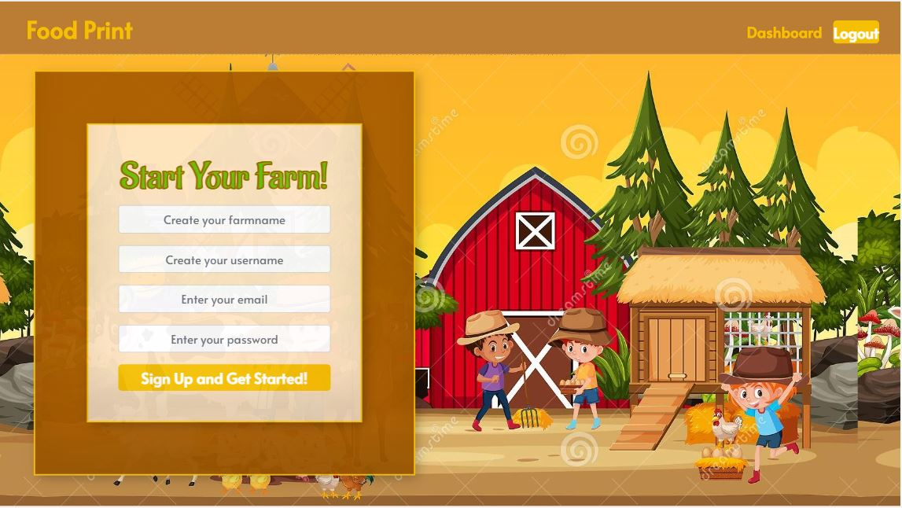

# Food-Print
## Description
This application can help you build your own virtual farm, 
## Table of Contents
- [Installation](#installation)
- [Usage](#usage)
- [Contributing](#contributing)
- [Tests](#tests)
- [Questions](#questions)
## Installation
To generate your own note taker, ``git clone`` the repo down to your local so you have the Node project on your local. Run npm install in order to install the following npm package dependencies as specified in the package.json. The application will start by running npm start in the command line. Then you can go to http://localhost:3001 to view your app.
You can test each module by running npm run test.
## Usage
* GIVEN I am using a virtual farm to raise animals,  
  * WHEN I open the application    
    THEN the user name, email, and password should be presented to start
  * WHEN I login in   
    THEN I am presented with a default farm name and I’m able to change it to another name
  * WHEN I login in    
    THEN I am presented with a default farm with initial animals including one chicken, sheep, and duck and fund number as 5000. 
  * WHEN I login in 
    THEN I am presented with animal market button.
  * WHEN I click the animal market button
    THEN I’m directed to the animal market page with available animals on the markets including animal name, sell price, cost price, and buttons of selling, buying, and close. 
    Note that in animal markets page, it should also display what animals that user own to allow them make decisions on selling or buying.
  * WHEN I click button of selling
    THEN I’m presented with prompted window including number box for user to enter and buttons of submit and cancel
  * When I click the button of submit on selling window,
    THEN the number of owned animal from user should be dedected; Meanwhile, the number of animal from market should be added;
      Money user owned should be added
  * WHEN I click button of buying
    THEN I’m presented with prompted window including number box for user to enter and buttons of submit and cancel
  * When I click the button of submit on buying window,
the number of owned animal from user should be added; Meanwhile, the number of animal from market should be reduced;
Money user owned should be reduced
  * WHEN I click button of cancel
    THEN either buying window or selling window should be closed and I’m presented on animal market page.

## Contributing
Please follow the industry standard.
## Tests
Please run ``npm run test`` test your application.
## Questions
This is my Github Profile https://github.com/Racheldeng1995. If you have any additional questions, please reach me at racheldeng1995@gmail.com.

